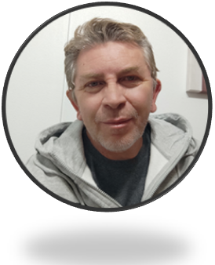

    
    <h1> Luis Marcelo Riquelme </h1>

    

## DWFS C16 Bootcamper

### Algo sobre mí

Me encanta la Informática y las nuevas tecnologías. Durante mi carrera en el área he adquirido diferentes conocimientos en:

* Sistemas Operativos
    * Windows
    * MacOs
    * Linux
* Servidores
    * Windows Server
    * Linux
        * Red Hat
        * Debian
        * Centos
        * Suse
* Redes de Datos
    * Cableado Estructurado
    * Fibra Optica
    * Radio Enlaces

Y hoy me encuentro realizando un super **Bootcamp** sobre **Desarrollo Web Full Stack**, me encuentro muy emocionado por ésta nueva experiencia y conocimientos para mi desarrollo personal. 

***¡ Vamos que se puede!***